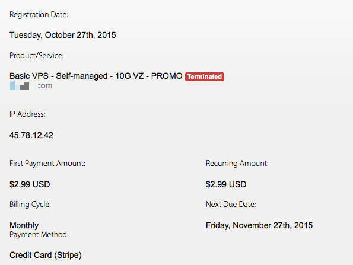
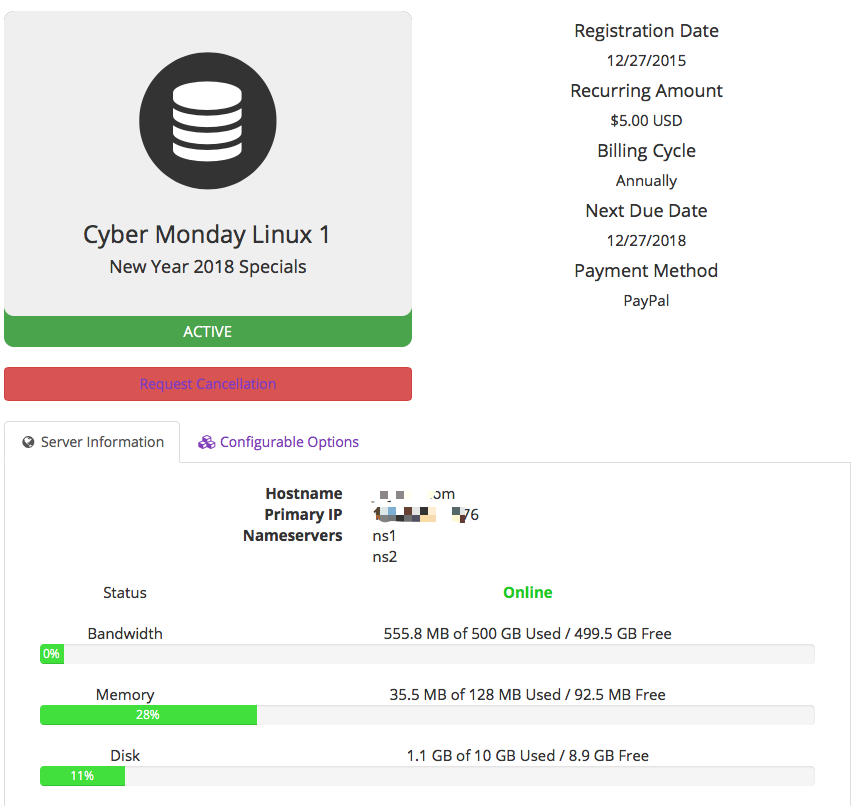

# VPS-Shadowsocks(纸飞机)服务端搭建&客户端推荐

# 1.Shadowsocks 服务端搭建

* [Debian下 shadowsocks-libev版一键安装脚本](https://teddysun.com/358.html)
* [CentOS下     shadowsocks-libev版一键安装脚本](https://teddysun.com/357.html)
* [CentOS/Debian/Ubuntu下 shadowsocks-Python版一键安装脚本](https://teddysun.com/342.html)
* [CentOS/Debian/Ubuntu下 shadowsocks-R版一键安装脚本](https://shadowsocks.be/9.html)
* [CentOS/Debian/Ubuntu下 shadowsocks-go版一键安装脚本](https://teddysun.com/392.html)

#### 使用root用户登录，运行以下命令
``
wget --no-check-certificate -O shadowsocks-all.sh https://raw.githubusercontent.com/teddysun/shadowsocks_install/master/shadowsocks-all.sh
chmod +x shadowsocks-all.sh
./shadowsocks-all.sh 2>&1 | tee shadowsocks-all.log
``

#### 安装完成后，脚本提示如下

Congratulations, your_shadowsocks_version install completed!
Your Server IP        :your_server_ip
Your Server Port      :your_server_port
Your Password         :your_password
Your Encryption Method:your_encryption_method

Your QR Code: (For Shadowsocks Windows, OSX, Android and iOS clients)
 ss://your_encryption_method:your_password@your_server_ip:your_server_port
Your QR Code has been saved as a PNG file path:
 your_path.png

Welcome to visit:https://teddysun.com/486.html
Enjoy it!

#### 卸载方法

若已安装多个版本，则卸载时也需多次运行（每次卸载一种）

使用root用户登录，运行以下命令：

./shadowsocks-all.sh uninstall
#### 启动脚本

启动脚本后面的参数含义，从左至右依次为：启动，停止，重启，查看状态。

Shadowsocks-Python 版：
/etc/init.d/shadowsocks-python start | stop | restart | status

ShadowsocksR 版：
/etc/init.d/shadowsocks-r start | stop | restart | status

Shadowsocks-Go 版：
/etc/init.d/shadowsocks-go start | stop | restart | status

Shadowsocks-libev 版：
/etc/init.d/shadowsocks-libev start | stop | restart | status

#### 各版本默认配置文件

Shadowsocks-Python 版：
/etc/shadowsocks-python/config.json

ShadowsocksR 版：
/etc/shadowsocks-r/config.json

Shadowsocks-Go 版：
/etc/shadowsocks-go/config.json

Shadowsocks-libev 版：
/etc/shadowsocks-libev/config.json

### 简单说下这四个版本的区别：
1. libev 版： 内存占用小(600k左右)，低 CPU 消耗，甚至可以安装在基于 OpenWRT 的路由器上
2. Python版： 支持多用户多端口配置
3. Go版： 与 Python 版不同的是，其客户端程序能使用多个服务端配置
4. R版：没用过~

# 2.Shadowsocks 客户端下载
1. [Windows 下载点击(github)](https://github.com/shadowsocks/shadowsocks-windows/releases)
2. [Mac 下载点击(github)](https://github.com/shadowsocks/ShadowsocksX-NG/releases/)
3. [Android 下载点击(github)](https://github.com/shadowsocks/shadowsocks-android/releases)
4. iOS AppStore 搜索"wingy"

# 3.VPS 购买推荐
1. [Badnwagon(搬瓦工)](https://bwh1.net/index.php)
2. [Alpharacks](https://www.alpharacks.com)
3. [老左博客推荐](http://www.laozuo.org/myvps)

#### 如果不着急使用，VPS购买切记赶在节假日之间(老外节日+国内节日)买，所购买价格即之后续费价格,可以先注册相应账号,然后节假日注意邮件消息
目前只接触过 Badnwagon和Alpharacks,简单说下使用心得: 

* 1. Badnwagon:  
月付2.99$套餐  
ping值在160ms左右  
提供一键搭建shadowsocks服务端按钮(不过密码跟端口号是它自己生成的)
 

* 2. Alpharacks:  
年付5$套餐  
ping值在190ms左右  
已经开始支持支付宝  

